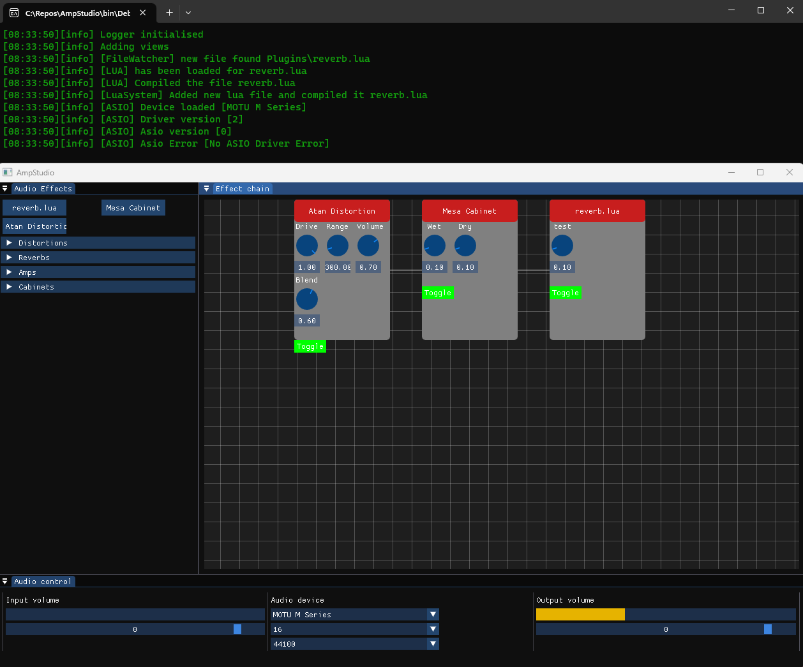

# AmpStudio
AmpStudio includes an amp simulator that allows you to create custom guitar amplifier models. The simulator is based on simple digital signal processing.

To create a custom amp model, you can use the Lua plugin system to define the DSP algorithm for your model. You can use any Lua library or function to implement the algorithm, and can define the parameters that control the behavior of the amp model.

Once you've defined your Lua plugin, you can load it into AmpStudio by placing it in the plugin folder in the root of the application.

AmpStudio is still under development and is not yet a stable release. As such, the software may contain bugs, performance issues, or other unexpected behavior.

## Images


## Getting started
Get source by ```git clone --recursive https://github.com/blackout1471/AmpStudio.git```
Run the GenerateSolution.bat to generate solution for amp studio.

## Lua Documentation
### Audio effects plugins
The audio buffers range goes from -1.0f -> 1.0f

Lua plugins has be placed in plugin folder in root of exe to be loaded.
The lua files has to have the functions
```lua
-- Meta data arguments is a table where data such as name & category can be set.
function OnInit(metaData)
end

-- The sample argument is the buffer for the audio
-- and works like a normal array object in lua
function OnBufferUpdate(sample)
end
```
### Meta data
The effects meta data can be set in the OnInit by using the first argument.
```lua
metaData.name = "Super effect name"
metaData.category = 2 -- This is the reverb one
```

### Gui
All gui related functions should be called only in OnInit.
```lua
param = parameter.add(name, max, min, step) -- Adds a effect parameter.

parameter.getValue(param) -- Get the current value of the effect parameter.
```
### Audio
[TBC]

### Simple sample
```lua
function OnInit(metaData)
    metaData.name = "Super gain" -- Name of plugin
    metaData.category = 0 -- Unknown category

    knob = parameter.add("gain", 1.0, 0, 0.1) -- effect parameter can be queried later for value
    parameter.getValue(knob)
end

function OnReadySample(sample)
    gain = parameter.getValue(knob) -- Get effect parameter gain value
    for i=1,#sample do -- Loop samples, the range is 1 -> sample length
        sample[i] = sample[i] * gain -- Set every sample multiplied by gain
    end
end
```

## Supported platforms
As of right now the application supports: Windows
The plan is to get it to build for Windows, Linux, ARM and mac os.

## Libraries
* Lua
* ImGui
* Asio (Window & Mac OS)
* Spdlog
* FFTConvolver -- plans to replace with own.

## Future
In the future i would like the application to be able to have a browse section where users can upload their effect plugins and be able download other created plugins.

## Contribute
I welcome contributions to AmpStudio! If you'd like to contribute, please follow these steps:

Fork the repository and create a new branch for your feature or bug fix.
Make your changes and test them thoroughly.
Create a pull request to merge your changes into the main repository.
Please make sure to follow the existing code style and conventions, and to thoroughly test your changes before submitting a pull request.

If you're unsure about anything, feel free to open an issue to discuss it.

## Reporting Bugs
If you encounter a bug in AmpStudio, please open an issue on the GitHub repository with a detailed description of the bug and steps to reproduce it. Please include any relevant error messages or logs.

## Feature Requests
If you have an idea for a new feature or improvement to AmpStudio, please open an issue on the GitHub repository with a detailed description of the feature and its use case. I will review the request and let you know if it's something we can add to the project.
